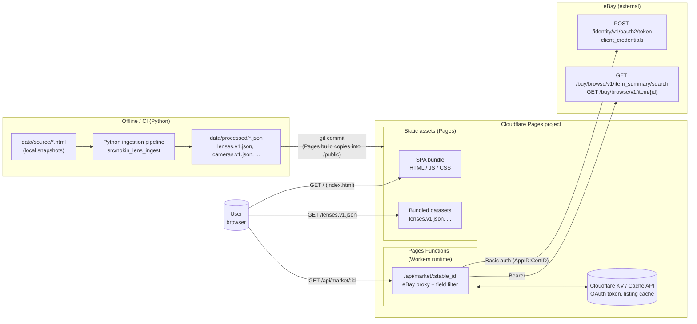
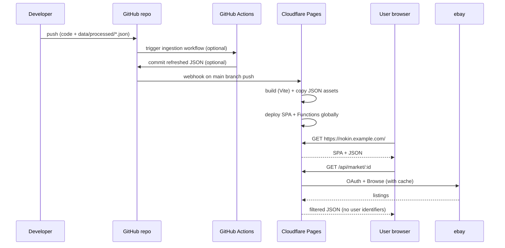

# System Architecture

This document describes the end-to-end architecture of the Nikon lens
explorer, validates the choice of Cloudflare Pages + Pages Functions as the
hosting target, and calls out the platform restrictions we need to design
around.

## Scope of the system

- **User-facing app.** A single-page app that loads a static dataset of Nikon
  lenses (and later cameras, accessories, serial numbers, compatibility) and
  lets the user search, filter, and open a detail view per item.
- **Market data overlay.** Inside the detail view, show current and
  recently-sold eBay listings for the selected item.
- **Offline data pipeline.** A reproducible ingestion pipeline that converts
  local HTML snapshots from photosynthesis.co.nz into canonical JSON
  datasets committed to the repo.

The system is intentionally read-heavy and stateless. There are no user
accounts, no persistent per-user state, no writes initiated from the
frontend.

## Component diagram
¬


## Component responsibilities

### 1. Offline ingestion pipeline (Python)

- Lives in `src/nokin_lens_ingest/` and `scripts/build_lens_dataset.py`.
- Reads local HTML snapshots under `data/source/`.
- Produces canonical JSON under `data/processed/`.
- Runs locally or in CI (GitHub Actions). **Does not run on Cloudflare.**
- The output JSON is committed to git and is the input to the frontend build.

Python is the right language here because:
- The dataset is small and bounded, so we don't need streaming infrastructure.
- BeautifulSoup + our existing code already work.
- This layer is completely decoupled from the runtime — the SPA only sees the
  JSON output, not the code that produced it.

### 2. Cloudflare Pages — static hosting

Hosts everything the browser needs to render the app:
- Built SPA bundle (HTML, JS, CSS, images).
- The canonical JSON datasets, copied from `data/processed/` into the SPA's
  `/public` or `/assets` folder during the build step.

Pages handles:
- Global CDN distribution (every asset cached at Cloudflare's edge).
- HTTPS and custom domains.
- Automatic builds on git push.

### 3. Pages Functions — eBay proxy

A small TypeScript function (code lives under `functions/api/` in the Pages
project) that:
1. Reads `EBAY_APP_ID` and `EBAY_CERT_ID` from the Pages environment
   (stored as secrets, not in git).
2. Fetches an OAuth application access token via `client_credentials` and
   caches it (KV, 2h lifetime, refreshed at ~90% of lifetime).
3. Takes a lens `stable_id` (or a search query derived from one) and calls
   the eBay Browse API.
4. Filters the response down to the allow-listed fields defined in
   `doc/ebay/INTEGRATION_POLICY.md` — **dropping all seller/buyer identity
   fields before the response leaves the function.**
5. Caches the filtered response (1h for active, 24h for sold) and returns it.

Running the proxy as a Pages Function (rather than a separate Worker) has a
concrete benefit: it lives on the same origin as the SPA, so there is no CORS
configuration and no separate deploy pipeline to maintain.

### 4. Cloudflare KV / Cache API — transient state

Two distinct caching needs, best served by two different Cloudflare primitives:

- **OAuth app token** → **KV.** Needs to be shared across all Workers
  invocations globally, has a coarse TTL (~2h), and is tiny (one string).
- **eBay listing responses** → **Cache API.** Keyed by request URL, per-colo
  is fine (users close to a colo will hit the warm cache), cheap and fast.

Both are optional for v1 — we could start with Cache API only and add KV if
cold-start OAuth fetches become a problem.

### 5. eBay APIs (external)

We talk to exactly two endpoints initially:
- `POST https://api.ebay.com/identity/v1/oauth2/token` — OAuth token refresh.
- `GET  https://api.ebay.com/buy/browse/v1/item_summary/search` — listings.

If we get approved for sold-data via Marketplace Insights, that adds a third.

## Validation against user constraints

### Confirmed: static website with "dynamic" URLs (React Router, deep links)

Concern from past projects: static hosts (e.g. GitHub Pages) return 404 when
the browser requests a URL like `/lenses/af-s__50__f1.4__g` because no such
file exists on disk.

**Cloudflare Pages handles this two ways:**

1. **SPA mode toggle.** In the Pages project settings there is a "Single
   Page Application" option that, when enabled, serves `index.html` for any
   request that doesn't match a concrete file. This is the recommended path
   for a React + React Router setup.
2. **`_redirects` file** (Netlify-compatible). Drop a file in the build
   output with a catch-all line:

   ```text
   /*    /index.html   200
   ```

   Same effect, explicit, lives in the repo.

Either way, URLs like `/lenses/:stable_id` work the moment React Router mounts
on the client — no pre-generated per-lens HTML pages required. This is
exactly the capability that GitHub Pages lacks out of the box.

### Confirmed: React on Cloudflare Pages

Fully supported. Pages has first-class build presets for React (CRA is
deprecated; Vite + React or Next.js are the recommended paths). Our bundle
builds with whatever tool we pick; Pages just serves the output.

**Recommendation: Vite + React**, because:
- Our app is pure client-side rendering of a static dataset. We don't need
  SSR/ISR, so Next.js's feature surface is overkill.
- Vite has the fastest dev loop and the simplest deploy story on Pages.
- React ecosystem for the UI bits we need (modal/dialog, command-palette
  search, virtualized lists for 678 lens rows) is mature.

Alternatives that would also work if you prefer: Astro (can render some pages
statically and hydrate the interactive parts), SvelteKit (with
`@sveltejs/adapter-cloudflare`), or SolidStart. None of these unlock a
feature we need that Vite + React doesn't — they're stylistic choices.

### Pushback: Python on the serverless side — not recommended

Cloudflare Workers runtime is V8 isolates, not a general-purpose OS. The
languages supported natively are JavaScript / TypeScript. Python is available
via **Python Workers** (open beta, Pyodide under the hood), but with
meaningful caveats:

- Cold starts are slower than JS Workers.
- Not every PyPI package works (must be Pyodide-compatible).
- Tooling and docs are less mature than the JS path.
- Our function is a thin proxy — fetch OAuth token, fetch Browse API, filter
  fields, return. There is no data processing that benefits from Python.

**Recommendation: TypeScript for the Pages Function.** We keep Python for the
offline ingestion pipeline, where it plays to its strengths (BeautifulSoup,
rich stdlib, easy iteration). The Worker is ~150 lines of TypeScript and
plays to the JS ecosystem's strengths.

This keeps a clean rule of thumb in the codebase:
- **Python** runs offline / in CI against source HTML to produce canonical JSON.
- **TypeScript** runs at the edge / in the browser to serve users.

### Cloudflare Pages restrictions worth knowing

Relevant limits for our use case (Free tier, then paid where noted):

| Limit | Free | Notes for us |
|---|---|---|
| Bandwidth | Unlimited | No concern. |
| Builds per month | 500 | Fine for git-push-driven deploys. |
| Files per deployment | 20,000 | We have ~10 files. No concern. |
| Single file size | 25 MB | Our lens JSON is ~1.5 MB; a combined multi-category bundle could approach this but unlikely to exceed it. |
| Pages Functions requests | 100,000/day free | Need to keep watch if caches miss often. |
| Pages Functions CPU time | 10ms (free), 30s wall (paid) | An OAuth+Browse fetch is dominated by network I/O, not CPU, so we stay under easily. |
| Secrets (env vars) | Available per environment | Standard way to inject `EBAY_APP_ID`, `EBAY_CERT_ID`. |

Relevant non-limits to be aware of:
- **No filesystem.** Pages Functions can't write to disk. All state is in KV,
  Durable Objects, D1, R2, or Cache API. For our needs, KV + Cache API is
  enough.
- **No long-running processes.** Functions must return within the CPU/wall
  budget. A single eBay round-trip is well within this. Background refresh
  of the OAuth token would need a Cron Trigger (also supported) if we want
  to avoid on-demand refresh latency — optional optimization, not a blocker.

### Dataset delivery strategy

Three options; picking the simplest one that holds up at our scale:

1. **Serve `lenses.v1.json` as a static asset** — browser fetches on first
   load, caches heavily via HTTP headers. **Recommended for v1.**
   Bundle size today: ~1.5 MB uncompressed, likely ~200 KB gzipped.
2. **Bundle the JSON into the JS build** via `import data from ...`. Same
   result, but less flexible (can't refresh data without a rebuild).
3. **Chunk by category or alphabetical prefix.** Only needed if the combined
   dataset (lenses + cameras + accessories) gets large enough that the
   initial load feels slow. Easy to introduce later without changing the
   architecture.

### CORS

Since both the SPA and the Pages Function live on the same origin (same
Pages project, same domain), there is no CORS configuration to manage.

### Frontend <-> Function contract

One thing worth designing now (not implementing): the shape of the JSON the
Function returns. The simplest contract:

```http
GET /api/market/:stable_id
→ 200 OK
{
  "stable_id": "af-s__50__f1.4__g",
  "active": [
    { "itemId": "...", "title": "...", "price": { "value": "599.00", "currency": "USD" },
      "condition": "USED_EXCELLENT", "itemWebUrl": "...", "imageUrl": "...",
      "itemEndDate": "...", "buyingOptions": ["FIXED_PRICE"], "itemLocation": { "country": "US" } }
  ],
  "sold": [ ... ],
  "fetched_at": "2026-04-16T..."
}
```

This lets the Function control the exact field set (which is also how we
enforce the allow-list in `doc/ebay/INTEGRATION_POLICY.md`) and gives the
frontend a stable contract it can render even when eBay changes their API.

## Deployment flow



The data refresh workflow (step "trigger ingestion workflow") is optional and
can start as a manual local run; automating it in CI is a later improvement.

## Open questions (to resolve when we start building)

- **Search engine on the frontend.** Do we use a client-side search library
  like Fuse.js or MiniSearch, or just filter arrays directly? 678 rows is
  small enough that a naive filter is probably fine.
- **Router choice.** React Router v6 vs TanStack Router vs a URL-state
  library like nuqs. Not architecturally significant; pick when starting
  the UI slice.
- **Attribution UI placement.** Persistent footer vs first-load modal. The
  session summary lists both as options.
- **Marketplace Insights approval timing.** Completed/sold listings require
  approval that can take time. The UI design should degrade gracefully when
  that endpoint is unavailable.

## What this doc does NOT decide

- The exact React component structure of the UI.
- The TypeScript type definitions for the market API response (will live
  alongside the function code when we write it).
- The CI provider choice for running the ingestion pipeline (GitHub Actions
  is the default but not binding).
- Whether to use D1 (SQLite) or R2 (object store) later — both are out of
  scope for v1.

## Summary of validated choices

| Concern | Decision | Why |
|---|---|---|
| Static hosting | Cloudflare Pages | Global CDN, first-class SPA routing, unified with Functions. |
| Serverless | Pages Functions (same project) | No CORS, single deploy pipeline, enough for an eBay proxy. |
| Frontend framework | Vite + React | Simple, mature, no SSR needed. |
| Function language | TypeScript | Native Workers runtime language; our Worker is a thin proxy. |
| Offline pipeline language | Python | Already built; right tool for HTML scraping and normalization. |
| Dataset delivery | Static JSON asset | Cached at edge + browser; simple; easy to scale later. |
| SPA deep links | Pages SPA mode (or `_redirects`) | Solves the GitHub Pages 404 issue. |
| Secrets storage | Pages environment secrets | Standard and secure. |
| Token/response cache | KV (tokens) + Cache API (listings) | Fits the shape of each data type. |
